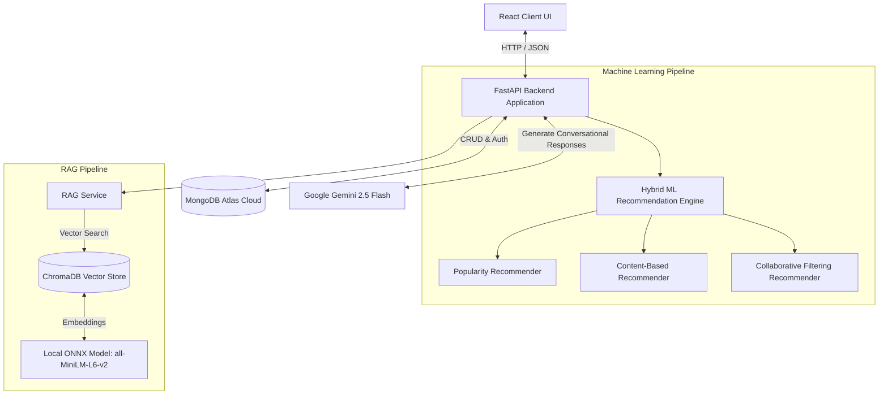

# 🛍️ AI-Powered Conversational Commerce Platform
> **Hybrid Recommendation Engine & RAG-Powered AI Shopping Assistant with Real-Time Analytics**

---

## 🌟 Live Demo

*   **Live Application (Hugging Face Spaces)**: [AI-Powered Conversational Commerce Platform](https://huggingface.co/spaces/Bharath2769/AI-Powered-Conversational-Commerce-Platform)
*   **Demo Login Credentials**:
    *   **Email**: `john.doe@example.com`
    *   **Password**: `password123`

*(Note: The Hugging Face Space serves both the React Frontend and the FastAPI Backend natively from a single unified Docker container!)*

---

## 📝 Overview

The **AI-Powered Conversational Commerce Platform** is a full-stack, enterprise-grade e-commerce engine that blends traditional recommendation algorithms with modern Generative AI. It solves the classic e-commerce discovery problem by offering both **dynamic product grids** based on user interactions and a **Retrieval-Augmented Generation (RAG) Chat Assistant** that users can talk to naturally.

### Why it Exists:
Standard e-commerce systems struggle with the **cold-start problem** (handling new users) and rigid search bars. This system solves these issues by orchestrating a dynamic machine learning pipeline that shifts strategies in real-time, while offering a conversational AI assistant that understands complex queries (e.g., *"I'm looking for a gaming laptop under $2000 with at least 16GB RAM"*).

---

## 🏗️ System Architecture

The application uses a decoupled but unified architecture. A **React SPA** (Single Page Application) serves as the presentation layer, communicating with a **FastAPI backend API** that handles ML execution, vector searches, and state preservation using a **MongoDB** database.



### End-to-End Sequence Flow (RAG Chat)
When a user asks the AI Assistant for a product:
1. The user's query is sent to the FastAPI backend.
2. **ChromaDB** embeds the query using a local ONNX model (`all-MiniLM-L6-v2`) to bypass API rate limits and ensure lightning-fast vector search.
3. The top 10 semantically relevant products are retrieved from the vector database.
4. The Hybrid ML Engine cross-references the retrieved products with the user's personal recommendation scores to **re-rank** the results.
5. The final context is passed to **Google's Gemini 2.5 Flash LLM**.
6. Gemini generates a conversational, personalized response explaining exactly *why* those products fit the user's needs.

---

## ⚡ Key Features

*   **💬 RAG-Powered AI Chat Assistant**: Talk naturally to the store. Built with ChromaDB, local ONNX embeddings, and Gemini 2.5 Flash.
*   **🧠 Multi-Strategy ML Pipeline**: Native support for Popularity-based ranking, Content-based filtering, User-User Collaborative filtering, and SVD Matrix Factorization.
*   **⚙️ Adaptive Strategy Selection**: Recommender engine automatically changes algorithms based on individual user interaction density (Views vs. Purchases).
*   **📊 Product Analytics Dashboard**: Interactive graphs displaying database counts and active model performance metrics.
*   **🔒 Secure Authentication**: JWT-based login, signup, and protected routing.
*   **🎨 State-of-the-Art UX**: Modern dark-themed user interface styled with Tailwind CSS, featuring radial gauges, responsive product grids, and interactive search.
*   **🐳 Hugging Face Deployment**: Fully dockerized to run as a unified service on Hugging Face Spaces (16GB RAM / 2 vCPU).

---

## 🧠 Recommendation Strategy

The machine learning engine dynamically orchestrates recommendation generation based on a user's interaction count. This ensures users are never shown empty recommendations, solving the classic cold-start problem.

| User Interaction Count | Active Recommender Strategy | Description |
| :--- | :--- | :--- |
| **0 Interactions** | 🔥 **Popularity-Based** | Baseline ranker. Recommends globally trending and high-rated items to new users. |
| **1 – 4 Interactions** | 📝 **Content-Based** | Computes similarity using TF-IDF vectors on product descriptions and features. |
| **5+ Interactions** | 👥 **Collaborative Filtering** | Employs User-User Cosine Similarity matrices with an SVD Matrix Factorization fallback. |

---

## 🛠️ Tech Stack

| Layer | Technologies Used | Key Purpose |
| :--- | :--- | :--- |
| **Frontend** | React (Vite), Tailwind CSS, Lucide icons, ChartJS | Client-side routing, modern visual analytics, responsive layout |
| **Backend** | FastAPI, Python 3.11, Pydantic v2, Uvicorn | High-performance async API endpoints, static file serving |
| **Database** | MongoDB Atlas | Document-based data store for user, product, and interaction records |
| **Vector Store** | ChromaDB | Local vector database for semantic product retrieval |
| **Machine Learning** | scikit-learn, ONNX Runtime | Matrix construction, TF-IDF calculation, local sentence embeddings |
| **Generative AI** | LangChain, Google Gemini API | Orchestrating RAG prompts and generating conversational text |
| **Infrastructure** | Docker, Hugging Face Spaces | Container encapsulation, continuous cloud deployment |

---

## 🎨 Screenshots

### 1. Analytics & Model Performance Dashboard


### 2. Dashboard System Overview


### 3. Personalized User Recommendations


---

## 🚀 Installation & Local Setup

### Running with Docker (Quickest)
1.  Clone the repository:
    ```bash
    git clone https://github.com/BharathReddyRamasani/AI-Powered-Conversational-Commerce-Platform.git
    cd AI-Powered-Conversational-Commerce-Platform
    ```
2. Set up environment variables in `.env`:
   * `MONGODB_URL`: Your MongoDB Connection String
   * `DB_NAME`: Database name
   * `SECRET_KEY`: Random string for JWT tokens
   * `GEMINI_API_KEY`: Your Google Gemini API Key
3.  Build and run the unified Docker container:
    ```bash
    docker build -t conversational-commerce .
    docker run -p 7860:7860 --env-file .env conversational-commerce
    ```
4.  Access the unified application:
    *   App: `http://localhost:7860`
    *   API Docs: `http://localhost:7860/docs`

---

## 🔮 Future Improvements

- [ ] **Redis Cache Layer**: Implement Redis caching for user recommendations to lower latency below 10ms.
- [ ] **Streaming Chat Responses**: Add server-sent events (SSE) to stream Gemini responses token-by-token.
- [ ] **Real-Time Stream Processing**: Utilize Kafka or RabbitMQ to stream user interactions directly to the ML models.
