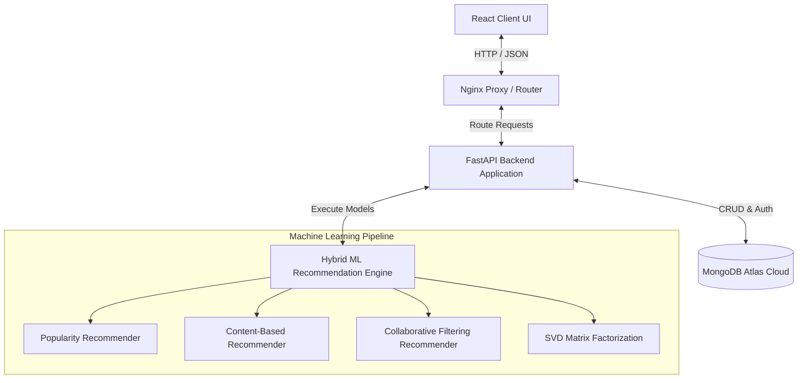
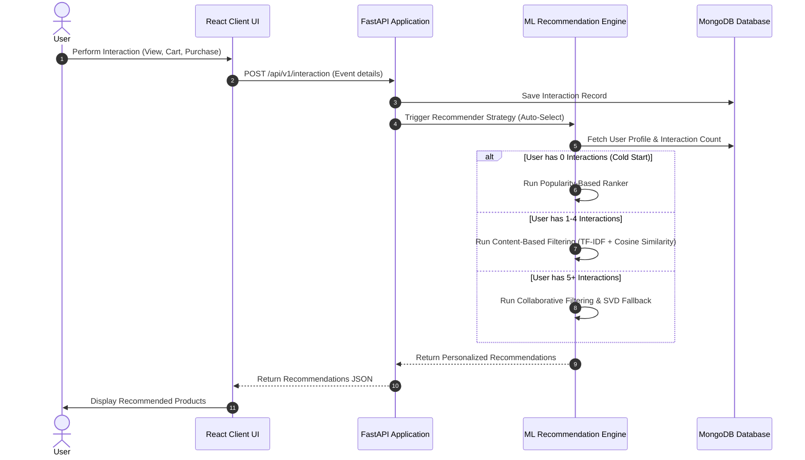
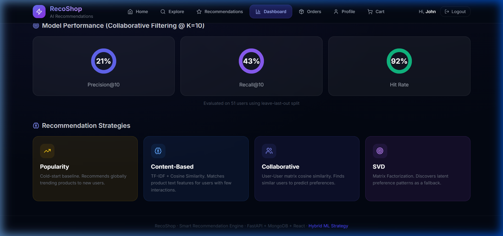
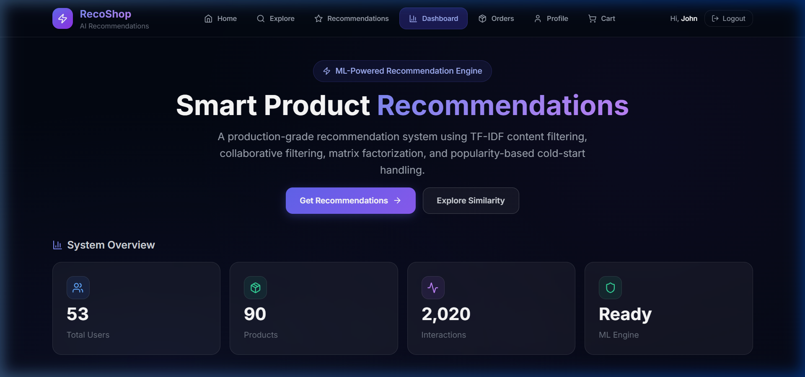
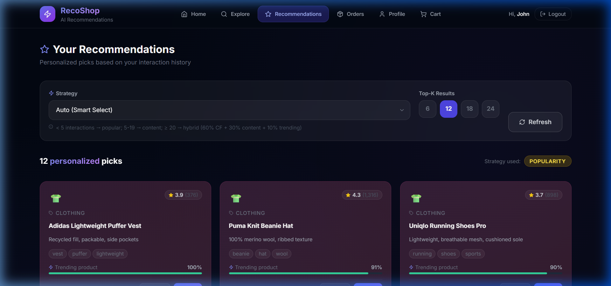

# Smart Product Recommendation & Analytics System

> **Hybrid Recommendation Platform with Personalized Product Discovery and Real-Time User Interaction Tracking**

---

## 🌟 Live Demo

*   **Frontend Web App**: [https://smart-product-recommendation-analytics-pnpt.onrender.com](https://smart-product-recommendation-analytics-pnpt.onrender.com)
*   **Backend API Service**: [https://smart-product-recommendation-analytics.onrender.com](https://smart-product-recommendation-analytics.onrender.com)
*   **Interactive API Docs**: [https://smart-product-recommendation-analytics.onrender.com/docs](https://smart-product-recommendation-analytics.onrender.com/docs)
*   **Demo Login Credentials**:
    *   **Email**: `john.doe@example.com`
    *   **Password**: `password123`

---

## 📝 Overview

The **Smart Product Recommendation & Analytics System** is a full-stack, enterprise-grade recommendation engine built to deliver highly personalized shopping experiences. In e-commerce, personalization is the strongest driver of engagement and conversion. This platform bridges the gap between static inventory listings and dynamic, user-centric discovery.

### Why it Exists:
Standard e-commerce systems struggle to recommend products effectively due to the **cold-start problem** (handling new users with no interactions) and the inability to blend content features with behavioral signals. This system solves both issues by orchestrating a dynamic machine learning pipeline that shifts strategies in real-time depending on the user's engagement footprint.

---

## 🏗️ System Architecture

The application is built using a modern, decoupled architecture. A **React SPA** (Single Page Application) serves as the presentation layer, communicating with a **FastAPI backend API** that handles ML execution and state preservation using a **MongoDB** document database.



### End-to-End Sequence Flow
When a user interacts with a product, the action is dispatched, logged, and instantly updates the recommendation metrics:



---

## ⚡ Features

*   **Multi-Strategy ML Pipeline**: Native support for Popularity-based ranking, Content-based filtering, User-User Collaborative filtering, and SVD Matrix Factorization.
*   **Adaptive Strategy Selection**: Recommender engine automatically changes algorithms based on individual user interaction density.
*   **Behavioral Event Tracking**: Real-time logging of user actions (Views, Add-to-Carts, Purchases) to dynamically retrain recommendations.
*   **Secure Authentication**: JWT-based login, signup, and protected routing.
*   **Product Analytics Dashboard**: Interactive graphs displaying database counts (total users, products, interactions) and active model performance metrics.
*   **State-of-the-Art UX**: Modern dark-themed user interface styled with Tailwind CSS, featuring radial gauges, responsive product grids, and interactive search.
*   **Dockerized Development**: Fully containerized multi-service stack ready for instant local orchestration.

---

## 🧠 Recommendation Strategy

The machine learning engine dynamically orchestrates recommendation generation based on a user's interaction count. This ensures users are never shown empty recommendations, solving the classic cold-start problem.

### 1. Adaptive Strategy Orchestration
| User Interaction Count | Active Recommender Strategy | Description |
| :--- | :--- | :--- |
| **0 Interactions** | 🔥 **Popularity-Based** | Baseline ranker. Recommends globally trending and high-rated items to new users. |
| **1 – 4 Interactions** | 📝 **Content-Based** | Computes similarity using TF-IDF vectors on product descriptions and features. |
| **5+ Interactions** | 👥 **Collaborative Filtering** | Employs User-User Cosine Similarity matrices with an SVD Matrix Factorization fallback. |

### 2. Interaction Weights
Implicit interactions carry different levels of intent. The system applies weighted mapping to evaluate user affinities:
*   **Product View**: `Weight = 1.0` (Soft Interest)
*   **Add to Cart**: `Weight = 3.0` (Medium Interest)
*   **Purchase**: `Weight = 5.0` (Strong Interest)

---

## 🛠️ Tech Stack

| Layer | Technologies Used | Key Purpose |
| :--- | :--- | :--- |
| **Frontend** | React (Vite), Tailwind CSS, Lucide icons, ChartJS | Client-side routing, modern visual analytics, responsive layout |
| **Backend** | FastAPI, Python 3.11, Pydantic v2, Uvicorn | High-performance async API endpoints, validation, CORS management |
| **Database** | MongoDB | Document-based data store for user, product, and interaction records |
| **Machine Learning** | NumPy, Pandas, scikit-learn, PyMongo | Matrix construction, TF-IDF calculation, Cosine Similarity computation |
| **Infrastructure** | Docker, Docker Compose, Nginx | Container encapsulation, Nginx proxying, local network routing |

---

## 🎨 Screenshots

### 1. Analytics & Model Performance Dashboard


### 2. Dashboard System Overview


### 3. Personalized User Recommendations


---

## 🧪 Evaluation Metrics

To guarantee that recommendations remain relevant, the pipeline evaluates Collaborative Filtering performance using a **leave-last-out** split on user history. The live models display the following scores on the dashboard:

*   📊 **Precision@10**: **21%** (Percentage of top-10 recommended items that matched the user's test set interest)
*   📈 **Recall@10**: **43%** (Percentage of the user's total test set items successfully retrieved in the top-10)
*   🎯 **Hit Rate**: **92%** (Likelihood that at least one of the top-10 recommended items matches the user's test set interest)

---

## 📡 API Endpoints

### Authentication
*   `POST /auth/register` — Register a new user
*   `POST /auth/login` — Log in and retrieve a JWT access token
*   `GET /auth/me` — Retrieve active user session profile

### Recommendations
*   `GET /api/v1/recommend/user/{id}` — Retrieve personalized recommendations (Supports `strategy=auto|popularity|content|collaborative`)
*   `GET /api/v1/recommend/product/{id}` — Find visually and descriptionally similar products
*   `GET /api/v1/metrics` — Retrieve evaluation metrics (Precision, Recall, Hit Rate)

### Interactions & Catalog
*   `POST /api/v1/interaction` — Record user activity (View, Cart, Purchase)
*   `GET /api/v1/products` — Retrieve paginated list of catalog items
*   `GET /api/v1/health` — Retrieve backend service and DB status

---

## 🚀 Installation & Local Setup

### Running with Docker Compose (Quickest)
1.  Clone the repository:
    ```bash
    git clone https://github.com/BharathReddyRamasani/Smart-Product-Recommendation-Analytics-System.git
    cd Smart-Product-Recommendation-Analytics-System
    ```
2.  Start the multi-container stack:
    ```bash
    docker-compose up --build
    ```
3.  Access the services:
    *   Frontend: `http://localhost:3000`
    *   Backend API: `http://localhost:8000`
    *   Interactive Docs: `http://localhost:8000/docs`

---

## 🔮 Future Improvements

- [ ] **Redis Cache Layer**: Implement Redis caching for user recommendations to lower latency below 10ms.
- [ ] **Async Background Training**: Shift model fitting to background workers (Celery/RQ) to avoid blocking request lifecycles.
- [ ] **Real-Time Stream Processing**: Utilize Kafka or RabbitMQ to stream user interactions directly to the ML models.
- [ ] **Explainability Module**: Enhance the recommendation cards to show explanation text (e.g. *"Recommended because you bought item X"*).